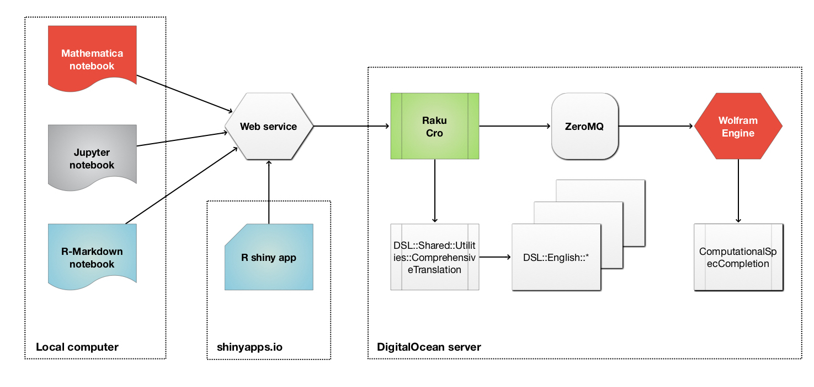

```{r setup, include=FALSE}
library(shiny)
library(shinybusy)
library(knitr)
library(flexdashboard)
library(DT)
library(rmarkdown)

library(ExternalParsersHookUp)
```


Parameters {.sidebar}
=======================================================================

```{r}
## Submission and URL
actionButton(inputId = "submitButton", 
             label = "Submit", 
             icon = icon("refresh"))

textInput( inputId = "webServiceURL", 
           label = "Web service URL:", 
           value = "http://accendodata.net:5040", 
           placeholder = "http://accendodata.net:5040")

hr()
## DSL parser type
radioButtons( inputId = "translatorType", 
              label = "Translation type:",
              choices = c(
                "Grammars" = "grammars",
                "Numeric word forms" = "numeric",
                "Question Answering System" = "qas"
              ),
              selected = "grammars"
)

hr()
## Programming language
radioButtons( inputId = "progLang", 
              label = "Programming language:",
              choices = c(
                # "Abstract Syntax Trees" = "ast",
                # "Julia" = "Julia",
                "Python" = "Python",
                "R" = "R",
                "Raku" = "Raku",
                "Wolfram Language" = "WL"
              ),
              selected = "R"
)


hr()
## Natural language
radioButtons( inputId = "fromLang", 
              label = "Natural language:",
              choices = c(
                "English" = "English",
                "Bulgarian" = "Bulgarian"
              ),
              selected = "English"
)

hr()
## Parsing into R or not
checkboxInput( inputId = "parseQ", label = ": parse to R expression?", value = FALSE )
```

```{r}
# Use this function somewhere in UI.
# See https://www.color-hex.com/color-palette/895
# or https://www.color-hex.com/color/994d00
# Dark orange: #994d00
add_busy_bar(color = "#ff6f69")
```


Main
=======================================================================

Column {.tabset}
-----------------------------------------------------------------------

### Commands

```{r}
textAreaInput( inputId = "userCommands", 
               label = "Commands:",
               placeholder = "DSL TARGET R::tidyverse;
use data dfMeals; 
inner join with dfFinelyFoodName over FOODID; 
group by 'Cuisine';
counts", 
value = "
DSL TARGET R::tidyverse;
use data dfMeals; 
inner join with dfFinelyFoodName over FOODID; 
group by 'Cuisine';
counts",
width = "100%", rows = 8 )

textUserCommands <- 
  reactive({
    
    if( nchar(input$userCommands) == 0) { 
      NULL 
    } else {
      input$userCommands
    }
    
  })
```


### URL

URL:

```{r}
consURL <- 
  reactive({
    if( input$translatorType == "grammars" ) {
      resURL <- paste0( input$webServiceURL, "/", "translate")
    } else if( input$translatorType == "qas") {
      resURL <- paste0( input$webServiceURL, "/", "translate", "/", "qas")
    } else if( input$translatorType == "numeric" ) {
      resURL <- paste0( input$webServiceURL, "/", "translate", "/", "numeric")
    } else {
      resURL <- input$webServiceURL
    }
    
    resURL <- gsub("//", "/", resURL, fixed = T)
    resURL
  })
```


```{r}
queryURL <- 
  reactive({
    query <- list()
    
    if( input$progLang == "ast") {
      query <- c(query, ast="True")
    } else {
      query <- c(query, lang=input$progLang)
    }
    
    if( input$fromLang == "Bulgarian") {
      query <- c(query, "from-lang" = "Bulgarian")
    } else {
      query <- c(query, "from-lang" = "English")
    }
  })
```


```{r}
renderPrint( expr = DSLWebServiceInterpretationURL(command = textUserCommands(), query = queryURL(), url = consURL()) )
```


### Translation

```{r}
lsInterpreted <- reactiveVal(list(CODE= "cat('Nothing yet')"))
lastResult <- reactiveVal(NULL)

dslwsError <- reactiveVal(NULL)

observeEvent(input$submitButton, {
  
  if( nchar(input$userCommands) == 0) { 
    
    lsInterpreted(NULL)
    
  } else {
    
    dwsResp <- InterpretByDSLWebService(command = textUserCommands(), query = queryURL(), url = consURL())

    if ( dwsResp$Success ) {
      
      res <- dwsResp$Content
      
      lsInterpreted(res[sort(names(res))])
      
      dslwsError(res$STDERR)
      
    } else {
      
      lsInterpreted(list(CODE= "cat('See the tab Errors')"))
      
      dslwsError(dwsResp$Response)
      
    }
  }
  
})
```


Interpreted:

```{r}
renderPrint(
  expr = lsInterpreted()
)
```


### Errors

```{r}
renderPrint(
  expr = dslwsError()
)
```


Column {.tabset}
-----------------------------------------------------------------------

```{r}
numericResult <- 
  reactive({   
    if( !is.null(lsInterpreted()$DSL) && grepl("^Lingua", lsInterpreted()$DSL)) {
      deparse( do.call( c, lapply(lsInterpreted()$CODE, function(x) setNames( as.character(x), names(x)))) )
    } else {
      ""
    }
  })
```

### Code

```{r}
verbatimTextOutput("code")
output$code <- renderText( 
  expr =
    if( !is.null(lsInterpreted()$DSL) && grepl("^Lingua", lsInterpreted()$DSL)) {
      numericResult()
    } else {
      lsInterpreted()$CODE
    }
)
```


### R expression

```{r}
verbatimTextOutput("codeParsed")
output$codeParsed <-
  renderPrint(
    expr =
      if( !is.null(lsInterpreted()$DSLTARGET) && grepl("^R", lsInterpreted()$DSLTARGET) && input$parseQ ) {
        parse( text = lsInterpreted()$CODE )
      } else if( !is.null(lsInterpreted()$DSL) && grepl("^Lingua", lsInterpreted()$DSL) && input$parseQ ) {
        parse( text = numericResult() )
      } else {
        ""
      }
  )
```


Examples
=======================================================================

Column {.tabset}
-----------------------------------------------------------------------

### Classification

```
DSL MODULE ClCon;
use data dfTitanic;
split data with fraction 0.8;
show classifier measurements;
show classifier confusion matrix plot, ROCCurve;
```

```
DSL TARGET WL::System;
use dfTitanic;
split data with fraction 0.8;
make gradient boosted trees classifier;
show classifier training time;
show classifier measurements;
show classifier confusion matrix plot, ROCCurve;
show top confusions, misclassified examples, least certain examples;
```

### Data wrangling

```
DSL TARGET R::tidyverse;
use data dfMeals; 
inner join with dfFinelyFoodName over FOODID; 
group by 'Cuisine';
show counts
```

```
DSL TARGET R;
use dfTitanic;
delete missing;
filter with 'passengerSex' is 'male' and 'passengerSurvival' equals 'died' or 'passengerSurvival' is 'survived';
cross tabulate 'passengerClass', 'passengerSurvival' over 'passengerAge';
```

```
DSL TARGET Python::pandas;
use dfTitanic;
delete missing;
filter with 'passengerSex' is 'male' and 'passengerSurvival' equals 'died' or 'passengerSurvival' is 'survived';
cross tabulate 'passengerClass', 'passengerSurvival' over 'passengerAge';
```

###  Epidemiologic Modeling

```
create with the model susceptible exposed infected two hospitalized recovered;
assign 100000 to the susceptible population;
set infected normally symptomatic population to be 0;
set infected severely symptomatic population to be 1;
assign 0.56 to contact rate of infected normally symptomatic population;
assign 0.58 to contact rate of infected severely symptomatic population;
assign 0.1 to contact rate of the hospitalized population;
simulate for 240 days;
plot populations results;
```

See [ECMMon-R at GitHub](https://github.com/antononcube/ECMMon-R).

### Latent Semantic Analysis

```
DSL MODULE LSAMon;
create from textHamlet;
make document term matrix with stemming FALSE and automatic stop words;
apply LSI functions global weight function IDF, local term weight function TermFrequency, normalizer function Cosine;
extract 12 topics using method NNMF and max steps 12 and 20 min number of documents per term;
show topics table with 12 terms;
show thesaurus table for king, castle, denmark;
```

See [LSAMon-R at GitHub](https://github.com/antononcube/R-packages/tree/master/LSAMon-R).

### Quantile Regression

```
DSL TARGET WL::QRMon;
use dfTemperatureData;
echo data summary;
compute quantile regression with 20 knots and probabilities 0.5 and 0.7;
show date list plots;
show error plots
```

See [QRMon-R at GitHub](https://github.com/antononcube/QRMon-R).


### Recommendation

```
DSL TARGET R::SMRMon;
create from dfTitanic;
make recommender;
recommend by profile 'male';
join across with dfTitanic;
echo pipeline value;
```

See [SMRMon-R at GitHub](https://github.com/antononcube/R-packages/tree/master/SMRMon-R).


References
=======================================================================

#### Articles

[JL1] Jérôme Louradour, 
["New in the Wolfram Language: FindTextualAnswer"](https://blog.wolfram.com/2018/02/15/new-in-the-wolfram-language-findtextualanswer/),
(2018),
[blog.wolfram.com](https://blog.wolfram.com).

[Wk1] Wikipedia entry, [Question answering](https://en.wikipedia.org/wiki/Question_answering).

#### Books

[AAb1] Anton Antonov,
[How to be a Data Scientist Impostor?](https://github.com/antononcube/HowToBeADataScientistImpostor-book),
(2019),
[GitHub/antononcube](https://github.com/antononcube).

[AAb2] Anton Antonov,
[Simplified Machine Learning Workflows](https://github.com/antononcube/SimplifiedMachineLearningWorkflows-book),
(2019),
[GitHub/antononcube](https://github.com/antononcube).

[AAb3] Anton Antonov,
[Raku for Prediction](https://github.com/antononcube/RakuForPrediction-book),
(2021),
[GitHub/antononcube](https://github.com/antononcube).


------

#### Packages, repositories

[AAr1] Anton Antonov,
[Conversational Agents](https://github.com/antononcube/ConversationalAgents),
(2017-2021),
[GitHub/antononcube](https://github.com/antononcube).

[AAr2] Anton Antonov,
[DSL::Shared::Utilities::ComprehensiveTranslation Raku package](https://github.com/antononcube/Raku-DSL-Shared-Utilities-ComprehensiveTranslation),
(2020),
[GitHub/antononcube](https://github.com/antononcube).

[ECE1] Edument Central Europe s.r.o.,
[https://cro.services](https://cro.services).


------

#### Videos

[AAv1] Anton Antonov,
["How to simplify Machine Learning workflows"](https://www.youtube.com/watch?v=b9Uu7gRF5KY),
(2020),
[useR! 2020 Conference](https://user2020.r-project.org).

[AAv2] Anton Antonov, 
["Multi-language Data-Wrangling Conversational Agent"](https://www.youtube.com/watch?v=pQk5jwoMSxs), 
(2020), 
[Wolfram Technology Conference 2020](https://www.wolfram.com/events/technology-conference/2020/).

[AAv3] Anton Antonov, 
["Raku for Prediction"](https://conf.raku.org/talk/157), 
(2021), 
[The Raku Conference 2021](https://conf.raku.org/).


-----

#### Components diagram

```{r, fig.width=10, fig.height=6}

```

The interactive interface utilizes:

- A server at RStudio's [shinyapps.io](https://www.shinyapps.io)

  - Launched on demand

- A server / droplet  at [DigitalOcean](https://www.digitalocean.com)

  - Permanent

- [Raku](https://raku.org) and the [Raku package Cro](https://cro.services)

- [Wolfram Engine (WE)](https://www.wolfram.com/engine/) connected to Raku through [ZeroMQ](https://zeromq.org)

   - WE is free for developers

