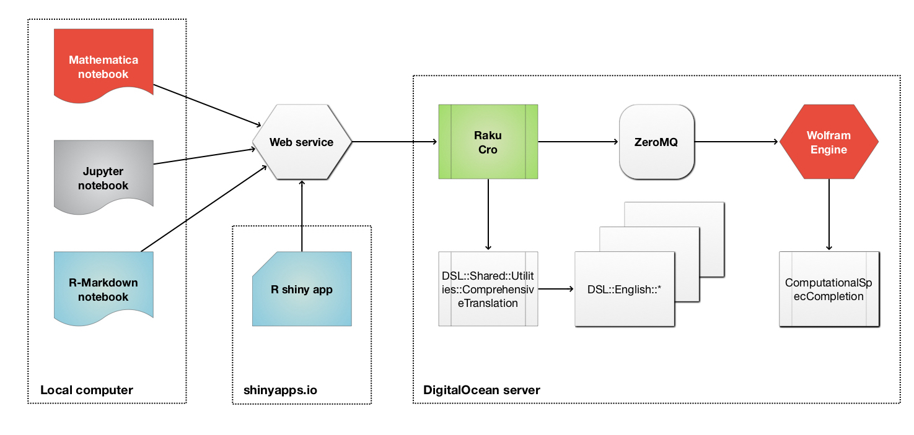

```{r setup, include=FALSE}
library(shiny)
library(knitr)
library(flexdashboard)
library(DT)
library(rmarkdown)
library(purrr)

library(ExternalParsersHookUp)
```


Parameters {.sidebar}
=======================================================================

```{r}
## Submission and URL
actionButton(inputId = "submitButton", 
             label = "Submit", 
             icon = icon("refresh"))

textInput( inputId = "webServiceURL", 
           label = "Web service URL:", 
           value = "http://accendodata.net:5040", 
           placeholder = "http://accendodata.net:5040")
```


```{r}
hr()
## Prepared sets of questions
radioButtons( inputId = "questionsPreset", 
              label = "Questions preset:",
              choices = c(
                "Generic" = "Generic",
                "Financial" = "Financial",
                "Food preparation" = "FoodPreparation",
                "Recruitment" = "Recruitment"
              ),
              selected = "Generic"
)
```


```{r, echo=F}
uiOutput("dynamic")

output$dynamic <- renderUI({ 
  
  lsChoices <- 
    if( input$questionsPreset == "Generic" ) {
      c("What name?", "What is person's full name?", "When born?", "What is this about?", "What are the dates?", "Where born?", "What occupation?", "What subject?", "Which country?")
    } else if( input$questionsPreset == "Financial" ) {
      c( "What is the trading volume?", "What price?", "How many investors?", "What is the total value?", "When it started?", "How long to mature?", "What kind of asset?", 
         "What is the stock price?", "What are the dates?", "What is the volatility?")
    } else if( input$questionsPreset == "FoodPreparation" ) {
      c( "How many eggs?", "What kind of vegetables?", "What kind of meat?", "How much flour?", "How long to cook?", "How long to boil?", "What are the ingredients?", "How much water?", "Which spices?",
         "What temperature to preheat to?", "What temperature to cook with?")
    } else if ( input$questionsPreset == "Recruitment" ) {
      c("What is person's name?", "Has sales experience?", "Worked in sales?", "Work places?", "Where did that person work?", "Worked in which companies?", "Where did they live?", 
        "Where lived?", "What this person knows the most?", "What is the best skill?", "What are the skills?", "What jobs?", "How many jobs?", "What is the favorite job?")
    } else {
      c("Enter your own questions.")
    }
  
  lsChoices <- sort(lsChoices)
  
  tagList( 
    selectInput( 
      inputId = "questionsList", 
      label = "Questions list:",  
      choices = lsChoices,
      selected = lsChoices[[1]],
      multiple = FALSE
    )
  )
})
```

```{r}
hr()
## User question
textInput( inputId = "userQuestion", 
           label = "Question:", 
           value = "", 
           placeholder = "What is the temperature?")
```

```{r}
hr()
## 
radioButtons( inputId = "qualityPerformanceGoal", 
              label = "Performance goal:",
              choices = c(
                "Quality" = "Quality",
                "Speed" = "Speed"
              ),
              selected = "Speed"
)

sliderInput( inputId = "numberOfAnswers", 
             label = "Number of answers:", 
             min = 1, max = 10, value = 3, step = 1 )

sliderInput( inputId = "answerOffsetLeft", 
             label = "Answer left offset:", 
             min = 0, max = 1000, value = 30, step = 1 )

sliderInput( inputId = "answerOffsetRight", 
             label = "Answer left offset:", 
             min = 0, max = 1000, value = 30, step = 1 )

checkboxInput( inputId = "showAnswerPositionsQ",
               label = ": show answer positions",
               value = FALSE )

```


Main
=======================================================================

Column {.tabset}
-----------------------------------------------------------------------

### Text

```{r}
textAreaInput( inputId = "userText", 
               label = "Text:",
               placeholder = "It is 34 degrees hot on September 5th.", 
               value = "It is 34 degrees hot on September 5th.",
               width = "100%", rows = 20 )

userText <- 
  reactive({
    
    if( nchar(input$userText) == 0) { 
      NULL 
    } else {
      input$userCommands
    }
    
  })
```


### URL

URL:

```{r}
consURL <- 
  reactive({
    paste0( input$webServiceURL, "/", "find-textual-answer" )
  })
```

```{r}
question <- 
  reactive({
    if( nchar(input$userQuestion) > 0) { input$userQuestion } else { input$questionsList[[1]] } 
  })
```

```{r}
consURLQuery <- 
  reactive({
    list( text = gsub( '"', '\'', iconv(input$userText, from = "", to = "UTF-8", sub = '')), question = question(), nAnswers = input$numberOfAnswers, performanceGoal = input$qualityPerformanceGoal )
  })
```

```{r}
renderPrint( expr = DSLWebServiceInterpretationURL( command = NULL, url = consURL(), query = consURLQuery() ) )
```


### Answers

```{r}
lsInterpreted <- reactiveVal(list(CODE= "cat('Nothing yet')"))
lastResult <- reactiveVal(NULL)

dslwsError <- reactiveVal(NULL)

observeEvent(input$submitButton, {
  
  if( nchar(input$userText) == 0) { 
    
    lsInterpreted(NULL)
    
  } else {
    
    dwsResp <- InterpretByDSLWebService( command = NULL, url = consURL(), query = consURLQuery() )

    if ( dwsResp$Success ) {
      
      res <- dwsResp$Content
      
      lsInterpreted(list( CODE = res ))
    
      dslwsError("")
      
    } else {
      
      lsInterpreted(list(CODE= "cat('See the tab Errors')"))
      
      dslwsError(dwsResp$Response)
      
    }
  }
  
})
```


Interpreted:

```{r}
renderPrint(
  expr = lsInterpreted()
)
```


### Errors

```{r}
renderPrint(
  expr = dslwsError()
)
```


Row 
-----------------------------------------------------------------------

```{r}
dfAnswers <- 
  reactive({
    if( !is.null(lsInterpreted()$CODE) && is.list(lsInterpreted()$CODE) ) {
       
      dfRes <- purrr::map_df( lsInterpreted()$CODE, function(x) data.frame( Probability = x$Probability, Position.Start = as.integer(x$Position[[1]]), Position.End = as.integer(x$Position[[2]])) )

      purrr::map_df( split( dfRes, 1:nrow(dfRes)), function(dfX) {
        cbind( dfX,
               
               Answer = 
                 substr( 
                   x = input$userText, 
                   start = dfX$Position.Start, 
                   stop = dfX$Position.End
                 ),
               
               Snippet = 
                 substr( 
                   x = input$userText, 
                   start = max( 1, dfX$Position.Start - input$answerOffsetLeft), 
                   stop = min( nchar(input$userText), dfX$Position.End + input$answerOffsetRight)
                 )
        )
      })
      
    } else {
      NULL
    }
  })
```


### Answers table

```{r}
DT::renderDataTable(
  expr = 
    DT::datatable(
      if( input$showAnswerPositionsQ ) {
        dfAnswers()
      } else {
        dfAnswers()[, c("Probability", "Answer", "Snippet")]
      }, 
      filter = 'top',
      options = list(scrollX = "300px", scrollY = "400px", scroller = TRUE, searchHighlight = TRUE )
    )
)
#options = list(scrollX = "300px", scrollY = "300px", scroller = TRUE, searchHighlight = TRUE, search = list(regex = TRUE, search = paste0( dfAnswers()$String, collapse = "|" ) ) )
```


Example texts
=======================================================================

Column {.tabset}
-----------------------------------------------------------------------

### Biography

```
Nikola Tesla (/ˈtɛslə/ TESS-lə; Serbian Cyrillic: Никола Тесла,[2] pronounced [nǐkola têsla];[a] 10 July [O.S. 28 June] 1856 – 7 January 1943) was a Serbian-American[5][6][7] inventor, electrical engineer, mechanical engineer, and futurist best known for his contributions to the design of the modern alternating current (AC) electricity supply system.[8]

Born and raised in the Austrian Empire, Tesla studied engineering and physics in the 1870s without receiving a degree, gaining practical experience in the early 1880s working in telephony and at Continental Edison in the new electric power industry. In 1884 he emigrated to the United States, where he became a naturalized citizen. He worked for a short time at the Edison Machine Works in New York City before he struck out on his own. With the help of partners to finance and market his ideas, Tesla set up laboratories and companies in New York to develop a range of electrical and mechanical devices. His alternating current (AC) induction motor and related polyphase AC patents, licensed by Westinghouse Electric in 1888, earned him a considerable amount of money and became the cornerstone of the polyphase system which that company eventually marketed.

Attempting to develop inventions he could patent and market, Tesla conducted a range of experiments with mechanical oscillators/generators, electrical discharge tubes, and early X-ray imaging. He also built a wireless-controlled boat, one of the first-ever exhibited. Tesla became well known as an inventor and demonstrated his achievements to celebrities and wealthy patrons at his lab, and was noted for his showmanship at public lectures. Throughout the 1890s, Tesla pursued his ideas for wireless lighting and worldwide wireless electric power distribution in his high-voltage, high-frequency power experiments in New York and Colorado Springs. In 1893, he made pronouncements on the possibility of wireless communication with his devices. Tesla tried to put these ideas to practical use in his unfinished Wardenclyffe Tower project, an intercontinental wireless communication and power transmitter, but ran out of funding before he could complete it.[9]

After Wardenclyffe, Tesla experimented with a series of inventions in the 1910s and 1920s with varying degrees of success. Having spent most of his money, Tesla lived in a series of New York hotels, leaving behind unpaid bills. He died in New York City in January 1943.[10] Tesla's work fell into relative obscurity following his death, until 1960, when the General Conference on Weights and Measures named the SI unit of magnetic flux density the tesla in his honor.[11] There has been a resurgence in popular interest in Tesla since the 1990s.[12]
```

Taken from https://en.wikipedia.org/wiki/Nikola_Tesla .

### Finance

```
Bitcoin

Prevailing bitcoin logo
Denominations
Plural	bitcoins
Symbol	₿ (Unicode: U+20BF ₿ BITCOIN SIGN (HTML &#8383;))[a]
Code	BTC, XBT[b]
Precision	10−8
Subunits	
 1⁄1000	millibitcoin
 1⁄100000000	satoshi[2]
Development
Original author(s)	Satoshi Nakamoto
White paper	"Bitcoin: A Peer-to-Peer Electronic Cash System"[4]
Implementation(s)	Bitcoin Core
Initial release	0.1.0 / 9 January 2009 (12 years ago)
Latest release	0.21.1 / 2 May 2021 (3 months ago)[3]
Code repository	github.com/bitcoin/bitcoin
Development status	Active
Website	bitcoin.org
Ledger
Ledger start	3 January 2009 (12 years ago)
Timestamping scheme	Proof-of-work (partial hash inversion)
Hash function	SHA-256
Issuance schedule	Decentralized (block reward)
Initially ₿50 per block, halved every 210,000 blocks[7]
Block reward	₿6.25[c]
Block time	10 minutes
Block explorer	Many implementations
Circulating supply	₿18,660,000 (as of 20 March 2021)
Supply limit	₿21,000,000[5][d]
^ The symbol was encoded in Unicode version 10.0 at position U+20BF ₿ BITCOIN SIGN in the Currency Symbols block in June 2017.[1]
^ Compatible with ISO 4217.
^ May 2020 to approximately 2024, halved approximately every four years
^ The supply will approach, but never reach, ₿21 million. Issuance will permanently halt c. 2140 at ₿20,999,999.9769.[6]:ch. 8
This article contains special characters. Without proper rendering support, you may see question marks, boxes, or other symbols.
Bitcoin (₿) is a decentralized digital currency, without a central bank or single administrator, that can be sent from user to user on the peer-to-peer bitcoin network without the need for intermediaries.[7] Transactions are verified by network nodes through cryptography and recorded in a public distributed ledger called a blockchain. The cryptocurrency was invented in 2008 by an unknown person or group of people using the name Satoshi Nakamoto.[8] The currency began use in 2009[9] when its implementation was released as open-source software.[6]:ch. 1
Bitcoins are created as a reward for a process known as mining. They can be exchanged for other currencies, products, and services,[10] but the real-world value of the coins is extremely volatile.[11] Research produced by the University of Cambridge estimated that in 2017, there were 2.9 to 5.8 million unique users using a cryptocurrency wallet, most of them using bitcoin.[12]
Bitcoin has been criticized for its use in illegal transactions, the large amount of electricity (and thus carbon footprint) used by mining, price volatility, and thefts from exchanges. Some economists and commentators have characterized it as a speculative bubble at various times. Bitcoin has also been used as an investment, although several regulatory agencies have issued investor alerts about bitcoin.[11][13][14]
The word bitcoin was defined in a white paper published on 31 October 2008.[4][15] It is a compound of the words bit and coin.[16] No uniform convention for bitcoin capitalization exists; some sources use Bitcoin, capitalized, to refer to the technology and network and bitcoin, lowercase, for the unit of account.[17] The Wall Street Journal,[18] The Chronicle of Higher Education,[19] and the Oxford English Dictionary[16] advocate the use of lowercase bitcoin in all cases.
```

Taken from https://en.wikipedia.org/wiki/Bitcoin .

### Food preparation

```
A comfort food classic, this Greek casserole is really delicious the day after, and believe it or not, it’s great straight out of the fridge for breakfast. Don't ask us how we know this, but if you like cold pizza, you'll like cold moussaka.

Ingredients

8 SERVINGS

EGGPLANT AND LAMB
8 garlic cloves, finely grated, divided
½ cup plus 2 tablespoons extra-virgin olive oil
2 tablespoons chopped mint, divided
2 tablespoons chopped oregano, divided
3 medium eggplants (about 3½ pounds total), sliced crosswise into ½-inch-thick rounds
2½ teaspoons kosher salt, plus more
½ teaspoon freshly ground black pepper, plus more
2 pounds ground lamb
2 medium onions, chopped
1 3-inch cinnamon stick
2 Fresno chiles, finely chopped
1 tablespoon paprika
1 tablespoon tomato paste
¾ cup dry white wine
1 28-ounce can whole peeled tomatoes

BÉCHAMEL AND ASSEMBLY
6 tablespoons unsalted butter
½ cup all-purpose flour
2½ cups whole milk, warmed
¾ teaspoon kosher salt
4 ounces farmer cheese, crumbled (about 1 cup)
2 ounces Pecorino or Parmesan, finely grated (about 1¾ cups), divided
3 large egg yolks, beaten to blend

Preparation

EGGPLANT AND LAMB

Step 1
Place a rack in middle of oven; preheat to 475°. Whisk half of the garlic, ½ cup oil, 1 Tbsp. mint, and 1 Tbsp. oregano in a small bowl. Brush both sides of eggplant rounds with herb oil, making sure to get all the herbs and garlic onto eggplant; season with salt and pepper. Transfer eggplant to a rimmed baking sheet (it’s okay to pile the rounds on top of each other) and roast until tender and browned, 35–45 minutes. Reduce oven temperature to 400°.

Step 2
Meanwhile, heat remaining 2 Tbsp. oil in a large wide pot over high. Cook lamb, breaking up with a spoon, until browned on all sides and cooked through and liquid from meat is evaporated (there will be a lot of rendered fat), 12–16 minutes. Strain fat through a fine-mesh sieve into a clean small bowl and transfer lamb to a medium bowl. Reserve 3 Tbsp. lamb fat; discard remaining fat.

Step 3
Heat 2 Tbsp. lamb fat in same pot over medium-high (reserve remaining 1 Tbsp. lamb fat for assembling the moussaka). Add onion, cinnamon, 2½ tsp. salt, and ½ tsp. pepper and cook, stirring occasionally, until onion is tender and translucent, 8–10 minutes. Add chiles and remaining garlic and cook, scraping up any browned bits from the bottom of the pot, until onion is golden brown, about 5 minutes. Add paprika and tomato paste and cook until brick red in color, about 1 minute. Add wine and cook, stirring occasionally, until slightly reduced and no longer smells of alcohol, about 3 minutes. Add tomatoes and break up with a wooden spoon into small pieces (the seeds will shoot out at you if you’re too aggressive, so start slowly—puncture the tomato, then get your smash and break on!). Add lamb and remaining 1 Tbsp. mint and 1 Tbsp. oregano and cook, stirring occasionally, until most of the liquid is evaporated and mixture looks like a thick meat sauce, 5–7 minutes. Pluck out and discard cinnamon stick.

BÉCHAMEL AND ASSEMBLY

Step 4
Heat butter in a medium saucepan over medium until foaming. Add flour and cook, whisking constantly, until combined, about 1 minute. Whisk in warm milk and bring sauce to a boil. Cook béchamel, whisking often, until very thick (it should have the consistency of pudding), about 5 minutes; stir in salt. Remove from heat and whisk in farmer cheese and half of the Pecorino. Let sit 10 minutes for cheese to melt, then add egg yolks and vigorously whisk until combined and béchamel is golden yellow.

Step 5
Brush a 13x9" baking pan with remaining 1 Tbsp. lamb fat. Layer half of eggplant in pan, covering the bottom entirely. Spread half of lamb mixture over eggplant in an even layer. Repeat with remaining eggplant and lamb to make another layer of each. Top with béchamel and smooth surface; sprinkle with remaining Pecorino.

Step 6
Bake moussaka until bubbling vigorously and béchamel is browned in spots, 30–45 minutes. Let cool 30 minutes before serving.
Step 7

Do Ahead: Moussaka can be baked 1 day ahead. Let cool, then cover and chill, or freeze up to 3 months. Thaw before reheating in a 250° oven until warmed through, about 1 hour.
```

Taken from https://www.bonappetit.com/recipe/moussaka .

### Recruitment

```
Olivia Harrison
1234 Avenue Street, City, State 12345
ITSpecialist@domain.com | 555.555.5555

Summary of Qualifications

Promote optimal performance, reliability, and security across core business systems

Results-driven professional offering a progressive, seven-year career in information technology.
Repeated success directing IT projects from inception to execution, strategically allocating resources and delegating tasks to achieve on-time, on-budget delivery.
Expertly manage technical support operations, diligently troubleshooting issues to identify root causes and prevent recurrence.
Process improvement champion with a history of implementing new procedures and technologies to strengthen security posture, enhance operational efficiency, and control costs.
– Areas of Expertise –

Testing & Troubleshooting | Project Management | System Administration

Vendor Relations | Strategic Planning | Resource Allocation | Effective Communication

Team Leadership | Business Continuity | Data Backup & Recovery

 

Technical Proficiencies

Platforms

Windows Vista/7/10; Mac OS X; Oracle; SAP

Software

Microsoft Office (Word, Excel, Outlook, PowerPoint, Project), SQL, and SharePoint; QuickBooks; Salesforce.com

Languages

Java, HTML, C++, PHP, Python, Ruby

 

Professional Experience

Gray & Associates, Seattle, Washington - 10/2010 to Present

System Administrator (6/2012 to Present)

Promoted to leadership role accountable for maintaining key business applications and systems. Partner with senior leadership to guide short- and long-range technology planning. Plan, coordinate, and execute hardware and software upgrades. Serve as vital resource for Help Desk staff, overseeing daily support operations and providing assistance on complex trouble tickets. Cultivate and maintain relationships with IT vendors.

Selected projects…

Successfully directed the on-time, on-budget completion of company-wide upgrade to Windows 10 and Office 365 impacting more than 50 onsite staff and five remote employees.
Initiated transformative IT policies designed to harden system security, including enhanced measures for password requirements and user access.
Spearheaded new procedures for Help Desk documentation, enabling the development of a comprehensive knowledge base of common issues and solutions to improve Help Desk efficiency.
Technical Support Specialist (10/2010 to 6/2012)

Provided technical support to end-users, leveraging broad-based expertise to handle problem identification, diagnosis, resolution, and escalation via helpdesk system, telephone, and remote support tools. Performed security administration functions for user, data, and remote access.

Selected projects…

Played an instrumental role in companywide migration from legacy customer relationship management (CRM) system to Salesforce.com by providing end-user training and support.
Developed step-by-step training manuals for end-users to ensure a seamless transition following application upgrades.
Anderson Consulting, Portland, Oregon

Help Desk Technician (3/2007 to 8/2010)

Performed troubleshooting, repair, and maintenance of computer systems, hardware, peripherals, and telephony. Analyzed system requirements to efficiently isolate and resolve a wide array of technical issues. Participated in large-scale upgrades and installations.

Selected Accomplishments…

Quickly learned and master proprietary applications.
Demonstrated outstanding customer services skills, consistently receiving high rating on client satisfaction surveys.
Excelled in previous roles as Desktop Support Technician for ABC Enterprises in Portland, Oregon(2004 to 2007) and as an Operations Manager for Fancy Restaurant in Eugene, Oregon (2000 to 2004)

Professional Development

Project Management Professional (PMP) Certification | Microsoft Certified Professional (MCP)

Microsoft Certified Solutions Expert (MCSE) | Microsoft Certified Solutions Associate (MCSA)

CompTIA A+ | CompTIA Security+ | CompTIA Network+ | CompTIA Project+
```

Taken from: https://www.monster.com/career-advice/article/sample-resume-for-it-professional .


References
=======================================================================

#### Articles

[JL1] Jérôme Louradour, 
["New in the Wolfram Language: FindTextualAnswer"](https://blog.wolfram.com/2018/02/15/new-in-the-wolfram-language-findtextualanswer/),
(2018),
[blog.wolfram.com](https://blog.wolfram.com).

[Wk1] Wikipedia entry, [Question answering](https://en.wikipedia.org/wiki/Question_answering).

#### Functions, packages, repositories

[AAr1] Anton Antonov,
[DSL::Shared::Utilities::ComprehensiveTranslation Raku package](https://github.com/antononcube/Raku-DSL-Shared-Utilities-ComprehensiveTranslation),
(2020),
[GitHub/antononcube](https://github.com/antononcube).

[ECE1] Edument Central Europe s.r.o.,
[https://cro.services](https://cro.services).

[WRI1] Wolfram Research, 
[FindTextualAnswer]( https://reference.wolfram.com/language/ref/FindTextualAnswer.html), 
(2018), 
[Wolfram Language function](https://reference.wolfram.com), (updated 2020).


-----

#### Components diagram

```{r, fig.width=10, fig.height=6}

```

The interactive interface utilizes:

- A server at RStudio's [shinyapps.io](https://www.shinyapps.io)

  - Launched on demand

- A server / droplet  at [DigitalOcean](https://www.digitalocean.com)

  - Permanent

- [Raku](https://raku.org) and the [Raku package Cro](https://cro.services)

- [Wolfram Engine (WE)](https://www.wolfram.com/engine/) connected to Raku through [ZeroMQ](https://zeromq.org)

   - WE is free for developers

