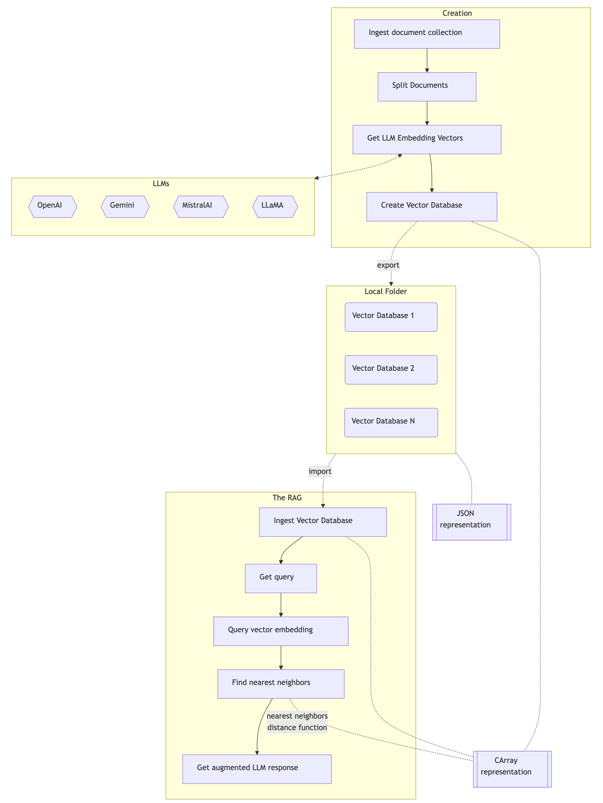

```{r setup, include=FALSE}
library(shiny)
library(shinybusy)
library(knitr)
library(flexdashboard)
library(DT)
library(rmarkdown)
library(httr)

library(ExternalParsersHookUp)
```


Main
=======================================================================

Parameters {.sidebar data-width=200}
-----------------------------------------------------------------------

```{r}
## Submission and URL
actionButton(inputId = "submitButton", 
             label = "Submit", 
             icon = icon("refresh"))

hr(style = "border-top: 1px solid #000000;")

## DSL parser type
radioButtons( inputId = "vectorDatabase", 
              label = "Knowledge base:",
              choices = c(
                "EconomicsAI" = "c4cd86f8-8908-44a4-8a39-9f9e476cba05",
                "No833" = "045f467c-193f-4df6-bec3-790d6c83ca64"
              ),
              selected = "c4cd86f8-8908-44a4-8a39-9f9e476cba05"
)

hr(style = "border-top: 1px solid #000000;")

numericInput(inputId = "nns", 
             label = "Number of nearest neighbors:",
             value = 12,
             min = 1, 
             max = 1000)

hr(style = "border-top: 1px solid #000000;")

## To language
radioButtons( inputId = "toLang", 
              label = "To language:",
              choices = c(
                "Bulgarian" = "Bulgarian",
                "English" = "English",
                "Russian" = "Russian",
                "Spanish" = "Spanish"
              ),
              selected = "English"
)
```

```{r}
# Use this function somewhere in UI.
# See https://www.color-hex.com/color-palette/895
# or https://www.color-hex.com/color/994d00
# Dark orange: #994d00
add_busy_bar(color = "#ff6f69")
```

Column {.tabset}
-----------------------------------------------------------------------

### Query

```{r}
textAreaInput( inputId = "userQuery", 
               label = "Commands:",
               placeholder = "Natural language query",
               value = "Talk about international tariffs.",
               width = "100%", rows = 8 )

textUserQuery <- 
  reactive({
    
    if( nchar(input$userQuery) == 0) { 
      NULL 
    } else {
      input$userQuery
    }
    
  })
```


### URL

URL:

```{r}
consURL <- 
  reactive({
    resURL <- paste0( input$webServiceURL, "/rag", "?query=", URLencode(textUserQuery()), "&nns=", input$nns)
    resURL <- gsub("//", "/", resURL, fixed = T)
    resURL
  })
```


```{r}
queryURL <- 
  reactive({
    query <- list()
    
    if( input$toLang == "ast") {
      query <- c(query, ast="True")
    } else {
      query <- c(query, lang=input$toLang)
    }
    
    query <- c(query, "from-lang" = input$fromLang)
  })
```


```{r}
renderPrint( expr = consURL())
```


### Translation

```{r}
lsInterpreted <- reactiveVal(list(CODE= "🈚️ Nothing yet"))
lastResult <- reactiveVal(NULL)

dslwsError <- reactiveVal(NULL)

observeEvent(input$submitButton, {
  
  if( nchar(trimws(input$userQuery)) == 0) { 
    
    lsInterpreted(NULL)
    
  } else {
    
    # Get current setup
    resp <- InterpretByDSLWebService(command = NULL, url = paste0( input$webServiceURL, "/", "setup_show"))
    
    if ( resp$Success ) {
      vdbID <- resp$Content[["vdb-id"]]
      
      # Load vector database if different one is specified
      if ( vdbID != input$vectorDatabase ) {
        
          resp <- InterpretByDSLWebService(command = NULL, url = paste0( input$webServiceURL, "/vdb_load", "?id=", input$vectorDatabase))
          
          if ( !resp$Success ) {
            lsInterpreted(list(CODE= "See the tab Errors"))
            dslwsError(resp$Response)
            return()
          }
      }
      
    } else {
      
      lsInterpreted(list(CODE= "See the tab Errors"))
      
      dslwsError(resp$Response)
      return()
    }
    
    dwsResp <- InterpretByDSLWebService(command = NULL, url = consURL())
          
    print(dwsResp)
    
    if ( dwsResp$Success ) {
      
      res <- dwsResp$Content
      
      lsInterpreted(list(CODE = res))
      
      dslwsError(dwsResp)
      
    } else {
      
      lsInterpreted(list(CODE= "See the tab Errors"))
      
      dslwsError(dwsResp$Response)
      
    }
  }
  
})
```


Interpreted:

```{r}
renderPrint(
  expr = lsInterpreted()
)
```


### Errors

```{r}
renderPrint(
  expr = dslwsError()
)
```


Column {data-height=900}
-----------------------------------------------------------------------

```{r}
numericResult <- 
  reactive({   
    if( !is.null(lsInterpreted()$DSL) && grepl("^Lingua", lsInterpreted()$DSL)) {
      deparse( do.call( c, lapply(lsInterpreted()$CODE, function(x) setNames( as.character(x), names(x)))) )
    } else {
      ""
    }
  })
```

### Response

```{r}
# div(style = "height: 400px; overflow-y: scroll; border: 1px solid #ccc; padding: 10px;", htmlOutput("code"))
# 
# output$code <- renderUI( shiny::HTML(gsub("\n", "<br>", lsInterpreted()$CODE, fixed = T)) )
# 
# htmlOutput("code")
```


```{r}
answer <- 
  reactive({ HTML(markdown::markdownToHTML(text = lsInterpreted()$CODE, fragment.only = TRUE)) })
     
div(class = "code-container", htmlOutput("code"))

output$code <- renderUI( shiny::HTML(answer()) )
htmlOutput("code")
```


Setup
=======================================================================

Row {.tabset}
-----------------------------------------------------------------------

### Parameters

```{r}
textInput( inputId = "webServiceURL", 
           label = "Web service URL:", 
           value = "http://localhost:10000", 
           placeholder = "http://localhost:10000")

hr(style = "border-top: 1px solid #000000;")
```


LLM configuration parameters:

```{r conf-params}
fluidRow(
  column(3, selectInput(inputId = "confName", label = "Service:", choices = c("ChatGPT", "Gemini", "LLaMA"), selected = "Gemini")),
  column(3, textInput(inputId = "confBaseURL", label = "Base URL:", value = "automatic")),
  column(3, textInput(inputId = "confModel", label = "Model:", value = "gemini-2.0-flash"))
)

fluidRow(
        column(3, numericInput("confTemperature", "temperature:", value = 0.65, min = 0, max = 2)),
        column(3, numericInput("confMaxTokens", "max-tokens:", value = 4096, min = 0, max = 16384))
)

actionButton(inputId = "confSubmitButton", 
             label = "Configure", 
             icon = icon("gear"))

hr(style = "border-top: 1px solid #000000;")
```


Vector database LLM embedding model configuration parameters:

```{r vdb-conf-params}
fluidRow(
  column(3, selectInput(inputId = "vdbConfName", label = "Service", choices = c("ChatGPT", "Gemini", "LLaMA"), selected = "LLaMA")),
  column(3, textInput(inputId = "vdbConfBaseURL", label = "Base URL:", value = "http://127.0.0.1:800")),
  column(3, textInput(inputId = "vdbConfModel", label = "Model", value = "llama-embedding"))
)

actionButton(inputId = "vdbConfSubmitButton", 
             label = "Configure", 
             icon = icon("gear"))

hr(style = "border-top: 1px solid #000000;")
```

```{r}
confResponse <- 
  reactive({
    
    # Create JSON data
    json_data <- list(
      "name" = input$confName, 
      "model" = input$confModel,
      "max-tokens" = input$confMaxTokens,
      "temperature" = input$confTempearture 
    )
    
    if( trimws(input$confBaseURL) != "automatic") {
      json_data[["base-url"]] = input$confBaseURL
    }
    
    # Perform the POST request
    response <- httr::POST(
      url = paste0(input$webServiceURL,"/setup_conf"),
      body = json_data,
      encode = "json",
      add_headers(
        "Content-Type" = "application/json",
        "Authorization" = "Bearer your_token_here" 
      )
    )
    
    # Check the status code
    status <- httr::status_code(response)
    cat("Status Code:", status, "\n")
    
    # Parse and view the response content
    if (status == 200) {
      response_content <- httr::content(response, as = "text")
    } else {
      response_content <- paste("Error:", httr::content(response, as = "text"))
    }
    
    print(response_content)
    
    response_content
  }) %>% bindEvent(input$confSubmitButton)
```


### LLM configuration server response

```{r}
output$confServerResponse <- renderText(confResponse())

verbatimTextOutput("confServerResponse")
```

```{r}
vdbConfResponse <- 
  reactive({
    
    # Create JSON data
    json_data <- list(
      "name" = input$vdbConfName, 
      "model" = input$vdbConfModel
    )
    
    if( trimws(input$confBaseURL) != "automatic") {
      json_data[["base-url"]] = input$confBaseURL
    }
    
    # Perform the POST request
    response <- httr::POST(
      url = paste0(input$webServiceURL,"/setup_vdb_conf"),
      body = json_data,
      encode = "json",
      add_headers(
        "Content-Type" = "application/json",
        "Authorization" = "Bearer your_token_here" 
      )
    )
    
    # Check the status code
    status <- httr::status_code(response)
    cat("Status Code:", status, "\n")
    
    # Parse and view the response content
    if (status == 200) {
      response_content <- httr::content(response, as = "text")
    } else {
      response_content <- paste("Error:", httr::content(response, as = "text"))
    }
    
    print(response_content)
    
    response_content
  }) %>% bindEvent(input$vdbConfSubmitButton)
```


### Vector database configuration server response

```{r}
output$vdbConfServerResponse <- renderText(vdbConfResponse())

verbatimTextOutput("vdbConfServerResponse")
```


References
=======================================================================

#### Packages, repositories

[AAp1] Anton Antonov,
[LLM::RetrievalAugmentedGeneration](https://github.com/antononcube/Raku-LLM-RetrievalAugmentedGeneration),
(2024-2025),
[GitHub/antononcube](https://github.com/antononcube).

[AAp1] Anton Antonov,
[LLM::Containerization](https://github.com/antononcube/Raku-LLM-Containerization),
(2024-2025),
[GitHub/antononcube](https://github.com/antononcube).


------

#### Videos

[AAv1] Anton Antonov,
["Raku RAG demo"](https://www.youtube.com/watch?v=JHO2Wk1b-Og),
(2020),
[YouTube/AAA4prediction](https://www.youtube.com/@AAA4prediction).


-----

#### Components diagram

```{r, fig.width=10, fig.height=6}

```

The interactive interface utilizes:

- A server at RStudio's [shinyapps.io](https://www.shinyapps.io)

  - Launched on demand

- A server / droplet  at [DigitalOcean](https://www.digitalocean.com)

  - Permanent

- [Raku](https://raku.org) and the [Raku package Cro](https://cro.services)

