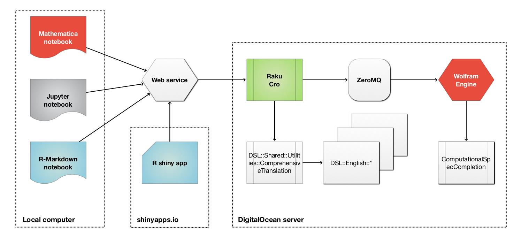

# DSL interactive interfaces

This project has interactive interfaces with Domain Specific Language (DSL) translations and evaluations.

Currently the interfaces are made with the package [`flexdashboard`](https://pkgs.rstudio.com/flexdashboard/),
but the plan is to move them to (strictly) [`shiny`](https://shiny.rstudio.com) for better development and feature
extensibility.

-------

## Published

- [DSL evaluations interface](http://antononcube.shinyapps.io/DSL-evaluations/)

- [FindTextualAnswer evaluations interface ](https://antononcube.shinyapps.io/FindTextualAnswer-evaluations/)

-------

## Using Wolfram Engine

Here is component diagram that describes "infracture backbone" of both interactive interfaces:

- A server at RStudio's [shinyapps.io](https://www.shinyapps.io)

  - Launched on demand

- A server / droplet  at [DigitalOcean](https://www.digitalocean.com)

  - Permanent

- [Raku](https://raku.org) and the [Raku package Cro](https://cro.services)

- [Wolfram Engine (WE)](https://www.wolfram.com/engine/) connected to Raku through [ZeroMQ](https://zeromq.org)

   - WE is free for developers
   
------

## References

#### Articles

[JL1] Jérôme Louradour, 
["New in the Wolfram Language: FindTextualAnswer"](https://blog.wolfram.com/2018/02/15/new-in-the-wolfram-language-findtextualanswer/),
(2018),
[blog.wolfram.com](https://blog.wolfram.com).

[Wk1] Wikipedia entry, [Question answering](https://en.wikipedia.org/wiki/Question_answering).

#### Books

[AAb1] Anton Antonov,
[How to be a Data Scientist Impostor?](https://github.com/antononcube/HowToBeADataScientistImpostor-book),
(2019),
[GitHub/antononcube](https://github.com/antononcube).

[AAb2] Anton Antonov,
[Simplified Machine Learning Workflows](https://github.com/antononcube/SimplifiedMachineLearningWorkflows-book),
(2019),
[GitHub/antononcube](https://github.com/antononcube).

[AAb3] Anton Antonov,
[Raku for Prediction](https://github.com/antononcube/RakuForPrediction-book),
(2021),
[GitHub/antononcube](https://github.com/antononcube).

#### Functions, packages, repositories

[AAr1] Anton Antonov,
[Conversational Agents](https://github.com/antononcube/ConversationalAgents),
(2017-2021),
[GitHub/antononcube](https://github.com/antononcube).

[AAr2] Anton Antonov,
[DSL::Shared::Utilities::ComprehensiveTranslation Raku package](https://github.com/antononcube/Raku-DSL-Shared-Utilities-ComprehensiveTranslation),
(2020),
[GitHub/antononcube](https://github.com/antononcube).

[ECE1] Edument Central Europe s.r.o.,
[https://cro.services](https://cro.services).

[WRI1] Wolfram Research, 
[FindTextualAnswer]( https://reference.wolfram.com/language/ref/FindTextualAnswer.html), 
(2018), 
[Wolfram Language function](https://reference.wolfram.com), (updated 2020).

#### Videos

[AAv1] Anton Antonov,
["How to simplify Machine Learning workflows"](https://www.youtube.com/watch?v=b9Uu7gRF5KY),
(2020),
[useR! 2020 Conference](https://user2020.r-project.org).

[AAv2] Anton Antonov, 
["Multi-language Data-Wrangling Conversational Agent"](https://www.youtube.com/watch?v=pQk5jwoMSxs), 
(2020), 
[Wolfram Technology Conference 2020](https://www.wolfram.com/events/technology-conference/2020/).

[AAv3] Anton Antonov, 
["Raku for Prediction"](https://conf.raku.org/talk/157), 
(2021), 
[The Raku Conference 2021](https://conf.raku.org/).

